# Diagrama de Arquitectura de Microservicios - CoopCredit


## Descripción de Servicios

### 🟢 Credit Application Service (Puerto 8080)

**Responsabilidad**: Gestión completa del ciclo de vida de solicitudes de crédito y afiliados

**Endpoints principales**:
- `/api/auth/**` - Autenticación y registro
- `/api/affiliates/**` - CRUD de afiliados
- `/api/credit-applications/**` - Gestión de solicitudes

**Base de datos**: PostgreSQL `credit_app_db`

**Tablas**:
- `affiliates` - Datos de afiliados
- `credit_applications` - Solicitudes de crédito
- `risk_evaluations` - Resultados de evaluación
- `users` - Usuarios del sistema
- `roles` - Roles de seguridad

**Dependencias externas**:
- Risk Central Service (HTTP REST)
- PostgreSQL
- Risk Central Mock (desarrollo)

**Observabilidad**:
- Métricas: `/actuator/prometheus`
- Health: `/actuator/health`
- Logs: JSON estructurado

### 🔵 Risk Central Service (Puerto 8081)

**Responsabilidad**: Evaluación de riesgo crediticio externa

**Endpoints**:
- `POST /api/risk/evaluate` - Evaluar riesgo de solicitud

**Request**:
```json
{
  "documentNumber": "1234567890",
  "requestedAmount": 5000000,
  "termMonths": 12,
  "monthlyIncome": 3000000,
  "currentDebts": 500000
}
```

**Response**:
```json
{
  "score": 750,
  "riskLevel": "LOW",
  "recommendation": "APPROVE",
  "evaluatedAt": "2025-12-09T15:00:00"
}
```

**Algoritmo de scoring**:
- Ratio de endeudamiento: 40%
- Capacidad de pago: 30%
- Monto vs ingreso: 20%
- Historial: 10%

**Base de datos**: PostgreSQL `risk_central_db`

### 🟣 Risk Central Mock (Puerto 9091)

**Responsabilidad**: Simulador para desarrollo y testing

**Funcionalidad**:
- Respuestas aleatorias pero realistas
- Sin persistencia
- Latencia simulada (~100ms)

**Uso**: Desarrollo local sin dependencia del servicio real

## Comunicación entre Microservicios

### Protocolo: HTTP REST (Síncrono)

```mermaid
sequenceDiagram
    participant Client as Cliente
    participant CAS as Credit Application Service
    participant RCS as Risk Central Service
    participant DB as PostgreSQL

    Client->>CAS: POST /api/credit-applications
    activate CAS
    
    CAS->>CAS: Validar datos y reglas de negocio
    CAS->>DB: Guardar solicitud (PENDING)
    
    CAS->>RCS: POST /api/risk/evaluate
    activate RCS
    RCS->>RCS: Calcular score de riesgo
    RCS-->>CAS: 200 OK {score, riskLevel, recommendation}
    deactivate RCS
    
    CAS->>DB: Guardar evaluación de riesgo
    CAS-->>Client: 201 Created {application + risk}
    deactivate CAS
```



### Configuración de Comunicación

**Credit Application Service** (`application.yml`):
```yaml
risk-service:
  url: ${RISK_SERVICE_URL:http://localhost:8081}
  timeout: 5000
  retry:
    max-attempts: 3
    backoff: 1000
```

**Resiliencia**:
- Circuit Breaker (futuro: Resilience4j)
- Timeout: 5 segundos
- Retry: 3 intentos con backoff
- Fallback: Evaluación manual

## Despliegue con Docker Compose

### Arquitectura de Contenedores

```yaml
version: '3.8'

services:
  postgres:
    image: postgres:15
    ports: 5432:5432
    environment:
      - Bases de datos: credit_app_db, risk_central_db
    volumes:
      - postgres_data:/var/lib/postgresql/data
      - ./init-scripts:/docker-entrypoint-initdb.d

  credit-app-service:
    build: ./credit-application-service
    ports: 8080:8080
    depends_on: [postgres]
    environment:
      - SPRING_DATASOURCE_URL=jdbc:postgresql://postgres:5432/credit_app_db
      - RISK_SERVICE_URL=http://risk-central-service:8081

  risk-central-service:
    build: ./risk-central-service
    ports: 8081:8081
    depends_on: [postgres]
    environment:
      - SPRING_DATASOURCE_URL=jdbc:postgresql://postgres:5432/risk_central_db

  risk-mock-service:
    build: ./risk-central-mock-service
    ports: 9091:9091

  pgadmin:
    image: dpage/pgadmin4
    ports: 5050:80
```

### Red Docker

- **Red**: `coopcredit-network`
- **DNS interno**: Los servicios se comunican por nombre
- **Aislamiento**: No exponer puertos innecesarios externamente

## Observabilidad

### Métricas Expuestas (Prometheus)

**Credit Application Service**:
- `credit_applications_created_total` - Total de solicitudes creadas
- `credit_applications_approved_total` - Solicitudes aprobadas
- `credit_applications_rejected_total` - Solicitudes rechazadas
- `risk_evaluation_duration_seconds` - Tiempo de evaluación de riesgo
- `http_server_requests_seconds` - Latencia de endpoints

**Risk Central Service**:
- `risk_evaluations_total` - Total de evaluaciones
- `risk_score_distribution` - Distribución de scores
- `risk_level_count` - Conteo por nivel de riesgo

### Logs Estructurados (JSON)

```json
{
  "timestamp": "2025-12-09T15:00:00.123Z",
  "level": "INFO",
  "service": "credit-application-service",
  "traceId": "abc123",
  "spanId": "def456",
  "thread": "http-nio-8080-exec-1",
  "logger": "com.coopcredit.creditapplication",
  "message": "Credit application created",
  "context": {
    "affiliateId": 1,
    "applicationId": 42,
    "amount": 5000000
  }
}
```

## Escalabilidad Futura

### Fase 1 (Actual): Monolito Modular
- 2 servicios + 1 mock
- Docker Compose
- PostgreSQL compartido (schemas separados)

### Fase 2: Microservicios Independientes
- API Gateway (Kong/Nginx)
- Service Discovery (Eureka/Consul)
- Config Server centralizado
- Bases de datos separadas

### Fase 3: Cloud Native
- Kubernetes (AKS/EKS)
- Service Mesh (Istio)
- Event-Driven (Kafka/RabbitMQ)
- CQRS + Event Sourcing

## Gestión de Configuración

| Propiedad | Desarrollo | Testing | Producción |
|-----------|-----------|---------|------------|
| Database URL | localhost:5432 | testcontainers | RDS/Cloud SQL |
| Risk Service URL | localhost:9091 (mock) | localhost:8081 | https://risk.prod |
| JWT Secret | test-secret-key | test-secret-key | ${JWT_SECRET} |
| Log Level | DEBUG | INFO | WARN |
| Actuator Exposure | * | health,metrics | health,prometheus |

## Seguridad entre Servicios

### Actual
- Sin autenticación entre servicios
- Red Docker aislada
- No exponer Risk Service externamente

### Futuro
- mTLS (mutual TLS)
- API Keys
- OAuth2 Client Credentials
- Service Mesh security policies

## Puertos y Endpoints

| Servicio | Puerto | Swagger UI | Actuator | Base Path |
|----------|--------|------------|----------|-----------|
| Credit App Service | 8080 | /swagger-ui.html | /actuator | /api |
| Risk Central Service | 8081 | /swagger-ui.html | /actuator | /api |
| Risk Mock Service | 9091 | - | - | /api |
| PostgreSQL | 5432 | - | - | - |
| PgAdmin | 5050 | http://localhost:5050 | - | - |
| Prometheus | 9090 | http://localhost:9090 | - | - |
| Grafana | 3000 | http://localhost:3000 | - | - |
