# Diagrama de Casos de Uso - Sistema de Solicitudes de Crédito

```mermaid
graph TB
    subgraph "ACTORES"
        AFFILIATE[👤 Afiliado]
        ADMIN[👨‍💼 Administrador]
        RISK_SYSTEM[🤖 Risk Central System]
    end

    subgraph "SISTEMA COOPCREDIT - GESTIÓN DE SOLICITUDES DE CRÉDITO"
        
        subgraph "Autenticación y Seguridad"
            UC1[UC-001<br/>Registrar Usuario]
            UC2[UC-002<br/>Iniciar Sesión]
            UC3[UC-003<br/>Renovar Token JWT]
        end
        
        subgraph "Gestión de Afiliados"
            UC4[UC-004<br/>Consultar Datos<br/>de Afiliado]
            UC5[UC-005<br/>Actualizar Datos<br/>de Afiliado]
            UC6[UC-006<br/>Crear Afiliado]
            UC7[UC-007<br/>Listar Afiliados]
            UC8[UC-008<br/>Eliminar Afiliado]
        end
        
        subgraph "Solicitudes de Crédito"
            UC9[UC-009<br/>Registrar Solicitud<br/>de Crédito]
            UC10[UC-010<br/>Consultar Solicitudes<br/>por Afiliado]
            UC11[UC-011<br/>Consultar Detalles<br/>de Solicitud]
            UC12[UC-012<br/>Evaluar Solicitud<br/>de Crédito]
        end
        
        subgraph "Evaluación de Riesgo"
            UC13[UC-013<br/>Solicitar Evaluación<br/>de Riesgo Externa]
            UC14[UC-014<br/>Registrar Resultado<br/>de Evaluación]
            UC15[UC-015<br/>Calcular Score<br/>de Riesgo]
        end
        
        subgraph "Consultas y Reportes"
            UC16[UC-016<br/>Consultar Métricas<br/>del Sistema]
            UC17[UC-017<br/>Consultar Logs<br/>Estructurados]
            UC18[UC-018<br/>Generar Reporte<br/>de Solicitudes]
        end
    end

    %% Relaciones - Afiliado
    AFFILIATE -->|registra cuenta| UC1
    AFFILIATE -->|inicia sesión| UC2
    AFFILIATE -->|consulta sus datos| UC4
    AFFILIATE -->|actualiza sus datos| UC5
    AFFILIATE -->|crea solicitud| UC9
    AFFILIATE -->|consulta solicitudes| UC10
    AFFILIATE -->|consulta detalles| UC11

    %% Relaciones - Administrador
    ADMIN -->|inicia sesión| UC2
    ADMIN -->|crea afiliados| UC6
    ADMIN -->|lista afiliados| UC7
    ADMIN -->|actualiza afiliados| UC5
    ADMIN -->|elimina afiliados| UC8
    ADMIN -->|evalúa solicitudes| UC12
    ADMIN -->|consulta métricas| UC16
    ADMIN -->|consulta logs| UC17
    ADMIN -->|genera reportes| UC18

    %% Relaciones - Sistema Externo
    UC13 -->|solicita evaluación| RISK_SYSTEM
    RISK_SYSTEM -->|retorna resultado| UC14

    %% Relaciones Include/Extend
    UC2 -.->|<<include>>| UC3
    UC9 -.->|<<include>>| UC13
    UC12 -.->|<<include>>| UC15
    UC12 -.->|<<extend>><br/>si aprobado| UC14
    UC9 -.->|<<include>>| UC4

    classDef actor fill:#FFE5B4,stroke:#FF8C00,stroke-width:3px
    classDef auth fill:#E0F0FF,stroke:#0066CC,stroke-width:2px
    classDef affiliate fill:#E0FFE0,stroke:#00AA00,stroke-width:2px
    classDef credit fill:#FFE0E0,stroke:#CC0000,stroke-width:2px
    classDef risk fill:#F0E0FF,stroke:#9900CC,stroke-width:2px
    classDef report fill:#F0F0F0,stroke:#666666,stroke-width:2px

    class AFFILIATE,ADMIN,RISK_SYSTEM actor
    class UC1,UC2,UC3 auth
    class UC4,UC5,UC6,UC7,UC8 affiliate
    class UC9,UC10,UC11,UC12 credit
    class UC13,UC14,UC15 risk
    class UC16,UC17,UC18 report
```



## Descripción de Casos de Uso

### 🔵 Autenticación y Seguridad

#### UC-001: Registrar Usuario
- **Actor**: Afiliado
- **Descripción**: Un nuevo afiliado se registra en el sistema
- **Flujo**:
  1. Ingresa datos personales (email, password, documento)
  2. Sistema valida formato y unicidad
  3. Crea usuario con rol AFFILIATE
  4. Retorna token JWT

#### UC-002: Iniciar Sesión
- **Actor**: Afiliado, Administrador
- **Descripción**: Usuario autentica sus credenciales
- **Flujo**:
  1. Ingresa email y password
  2. Sistema valida credenciales
  3. Genera token JWT
  4. Retorna token con tiempo de expiración

#### UC-003: Renovar Token JWT
- **Actor**: Sistema
- **Descripción**: Renueva token antes de expiración
- **Incluido en**: UC-002

### 🟢 Gestión de Afiliados

#### UC-004: Consultar Datos de Afiliado
- **Actor**: Afiliado, Administrador
- **Descripción**: Consulta información de un afiliado
- **Precondición**: Usuario autenticado

#### UC-005: Actualizar Datos de Afiliado
- **Actor**: Afiliado (propios datos), Administrador (cualquier afiliado)
- **Descripción**: Actualiza información personal
- **Campos**: Teléfono, email, salario

#### UC-006: Crear Afiliado
- **Actor**: Administrador
- **Descripción**: Registra un nuevo afiliado en el sistema
- **Datos**: Documento, nombre, email, salario, fecha afiliación

#### UC-007: Listar Afiliados
- **Actor**: Administrador
- **Descripción**: Obtiene lista paginada de afiliados
- **Filtros**: Estado, documento, email

#### UC-008: Eliminar Afiliado
- **Actor**: Administrador
- **Descripción**: Elimina lógicamente un afiliado (cambia estado a INACTIVE)

### 🔴 Solicitudes de Crédito

#### UC-009: Registrar Solicitud de Crédito
- **Actor**: Afiliado
- **Descripción**: Afiliado crea nueva solicitud de crédito
- **Flujo**:
  1. Valida elegibilidad del afiliado (activo + 3 meses antigüedad)
  2. Valida monto solicitado ≤ límite de crédito
  3. Calcula cuota mensual
  4. Valida ratio de endeudamiento ≤ 40%
  5. Solicita evaluación de riesgo externa
  6. Registra solicitud en estado PENDING
- **Incluye**: UC-004, UC-013

#### UC-010: Consultar Solicitudes por Afiliado
- **Actor**: Afiliado (propias solicitudes), Administrador (todas)
- **Descripción**: Lista solicitudes de un afiliado específico
- **Orden**: Más recientes primero

#### UC-011: Consultar Detalles de Solicitud
- **Actor**: Afiliado, Administrador
- **Descripción**: Obtiene información completa de una solicitud
- **Incluye**: Datos afiliado, evaluación de riesgo, cálculos financieros

#### UC-012: Evaluar Solicitud de Crédito
- **Actor**: Administrador
- **Descripción**: Revisa y decide sobre una solicitud
- **Acciones**: Aprobar, Rechazar, Marcar para Revisión
- **Incluye**: UC-015, UC-014 (si aprueba)

### 🟣 Evaluación de Riesgo

#### UC-013: Solicitar Evaluación de Riesgo Externa
- **Actor**: Sistema
- **Descripción**: Envía datos al Risk Central Service
- **Request**: Documento, monto, plazo, salario, deudas
- **Response**: Score, nivel de riesgo, recomendación

#### UC-014: Registrar Resultado de Evaluación
- **Actor**: Sistema
- **Descripción**: Almacena resultado de evaluación externa
- **Datos**: Score, risk level, recommendation

#### UC-015: Calcular Score de Riesgo
- **Actor**: Sistema
- **Descripción**: Calcula score interno basado en:
  - Ratio de endeudamiento
  - Antigüedad como afiliado
  - Monto vs límite de crédito
  - Historial de solicitudes

### ⚙️ Consultas y Reportes

#### UC-016: Consultar Métricas del Sistema
- **Actor**: Administrador
- **Endpoint**: `/actuator/metrics`, `/actuator/prometheus`
- **Métricas**: Solicitudes creadas, evaluadas, aprobadas, rechazadas

#### UC-017: Consultar Logs Estructurados
- **Actor**: Administrador
- **Descripción**: Accede a logs JSON con trazabilidad
- **Campos**: timestamp, level, service, traceId, message

#### UC-018: Generar Reporte de Solicitudes
- **Actor**: Administrador
- **Descripción**: Exporta reporte con filtros
- **Filtros**: Rango de fechas, estado, afiliado

## Reglas de Negocio

### RN-001: Elegibilidad para Solicitar Crédito
- Afiliado debe estar ACTIVO
- Mínimo 3 meses de antigüedad
- No tener solicitudes PENDING

### RN-002: Límite de Crédito
- Límite = Salario × Multiplicador (default: 3)
- Monto solicitado ≤ Límite de crédito

### RN-003: Ratio de Endeudamiento
- Ratio = (Cuota Mensual + Deudas Actuales) / Salario
- Ratio máximo permitido: 40%

### RN-004: Cálculo de Cuota Mensual
```
Cuota = Monto × [r(1+r)^n] / [(1+r)^n - 1]
Donde:
  r = tasa de interés mensual
  n = número de meses
```

### RN-005: Estados de Solicitud
- **PENDING**: Solicitud creada, esperando evaluación
- **APPROVED**: Aprobada por administrador
- **REJECTED**: Rechazada
- **UNDER_REVIEW**: Requiere revisión adicional

## Matriz de Autorización

| Caso de Uso | Afiliado | Administrador |
|-------------|----------|---------------|
| UC-001 Registrar Usuario | ✅ | ❌ |
| UC-002 Iniciar Sesión | ✅ | ✅ |
| UC-004 Consultar Afiliado | ✅ (propio) | ✅ (todos) |
| UC-005 Actualizar Afiliado | ✅ (propio) | ✅ (todos) |
| UC-006 Crear Afiliado | ❌ | ✅ |
| UC-007 Listar Afiliados | ❌ | ✅ |
| UC-008 Eliminar Afiliado | ❌ | ✅ |
| UC-009 Crear Solicitud | ✅ | ❌ |
| UC-010 Consultar Solicitudes | ✅ (propias) | ✅ (todas) |
| UC-011 Consultar Detalles | ✅ (propias) | ✅ (todas) |
| UC-012 Evaluar Solicitud | ❌ | ✅ |
| UC-016 Consultar Métricas | ❌ | ✅ |
| UC-017 Consultar Logs | ❌ | ✅ |
| UC-018 Generar Reportes | ❌ | ✅ |
