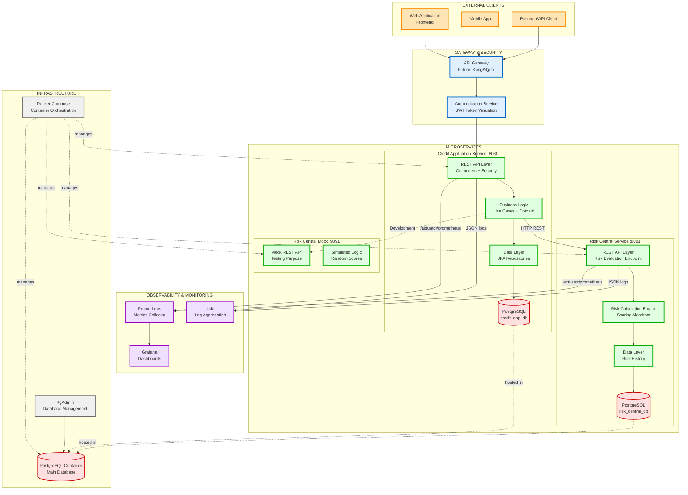
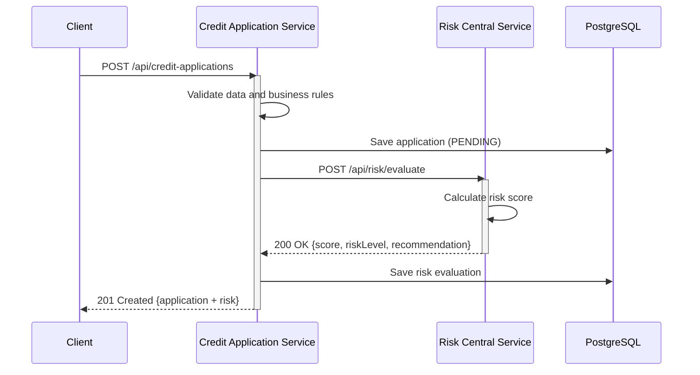

# Microservices Architecture Diagram - CoopCredit



## Service Description

### 🟢 Credit Application Service (Port 8080)

**Responsibility**: Full lifecycle management of credit applications and affiliates

**Main Endpoints**:
- `/api/auth/**` - Authentication and registration
- `/api/affiliates/**` - Affiliate CRUD
- `/api/credit-applications/**` - Application management

**Database**: PostgreSQL `credit_app_db`

**Tables**:
- `affiliates` - Affiliate data
- `credit_applications` - Credit applications
- `risk_evaluations` - Evaluation results
- `users` - System users
- `roles` - Security roles

**External Dependencies**:
- Risk Central Service (HTTP REST)
- PostgreSQL
- Risk Central Mock (development)

**Observability**:
- Metrics: `/actuator/prometheus`
- Health: `/actuator/health`
- Logs: Structured JSON

### 🔵 Risk Central Service (Port 8081)

**Responsibility**: External credit risk evaluation

**Endpoints**:
- `POST /api/risk/evaluate` - Evaluate application risk

**Request**:
```json
{
  "documentNumber": "1234567890",
  "requestedAmount": 5000000,
  "termMonths": 12,
  "monthlyIncome": 3000000,
  "currentDebts": 500000
}
```

**Response**:
```json
{
  "score": 750,
  "riskLevel": "LOW",
  "recommendation": "APPROVE",
  "evaluatedAt": "2025-12-09T15:00:00"
}
```

**Scoring Algorithm**:
- Debt ratio: 40%
- Payment capacity: 30%
- Amount vs Income: 20%
- History: 10%

**Database**: PostgreSQL `risk_central_db`

### 🟣 Risk Central Mock (Port 9091)

**Responsibility**: Simulator for development and testing

**Functionality**:
- Random but realistic responses
- No persistence
- Simulated latency (~100ms)

**Usage**: Local development without dependency on the real service

## Microservices Communication

### Protocol: HTTP REST (Synchronous)



### Communication Configuration

**Credit Application Service** (`application.yml`):
```yaml
risk-service:
  url: ${RISK_SERVICE_URL:http://localhost:8081}
  timeout: 5000
  retry:
    max-attempts: 3
    backoff: 1000
```

**Resilience**:
- Circuit Breaker (future: Resilience4j)
- Timeout: 5 seconds
- Retry: 3 attempts with backoff
- Fallback: Manual evaluation

## Deployment with Docker Compose

### Container Architecture

```yaml
version: '3.8'

services:
  postgres:
    image: postgres:15
    ports: 5432:5432
    environment:
      - Databases: credit_app_db, risk_central_db
    volumes:
      - postgres_data:/var/lib/postgresql/data
      - ./init-scripts:/docker-entrypoint-initdb.d

  credit-app-service:
    build: ./credit-application-service
    ports: 8080:8080
    depends_on: [postgres]
    environment:
      - SPRING_DATASOURCE_URL=jdbc:postgresql://postgres:5432/credit_app_db
      - RISK_SERVICE_URL=http://risk-central-service:8081

  risk-central-service:
    build: ./risk-central-service
    ports: 8081:8081
    depends_on: [postgres]
    environment:
      - SPRING_DATASOURCE_URL=jdbc:postgresql://postgres:5432/risk_central_db

  risk-mock-service:
    build: ./risk-central-mock-service
    ports: 9091:9091

  pgadmin:
    image: dpage/pgadmin4
    ports: 5050:80
```

### Docker Network

- **Network**: `coopcredit-network`
- **Internal DNS**: Services communicate by name
- **Isolation**: Do not expose unnecessary ports externally

## Observability

### Exposed Metrics (Prometheus)

**Credit Application Service**:
- `credit_applications_created_total` - Total applications created
- `credit_applications_approved_total` - Applications approved
- `credit_applications_rejected_total` - Applications rejected
- `risk_evaluation_duration_seconds` - Risk evaluation time
- `http_server_requests_seconds` - Endpoint latency

**Risk Central Service**:
- `risk_evaluations_total` - Total evaluations
- `risk_score_distribution` - Score distribution
- `risk_level_count` - Count by risk level

### Structured Logs (JSON)

```json
{
  "timestamp": "2025-12-09T15:00:00.123Z",
  "level": "INFO",
  "service": "credit-application-service",
  "traceId": "abc123",
  "spanId": "def456",
  "thread": "http-nio-8080-exec-1",
  "logger": "com.coopcredit.creditapplication",
  "message": "Credit application created",
  "context": {
    "affiliateId": 1,
    "applicationId": 42,
    "amount": 5000000
  }
}
```

## Future Scalability

### Phase 1 (Current): Modular Monolith
- 2 services + 1 mock
- Docker Compose
- Shared PostgreSQL (separate schemas)

### Phase 2: Independent Microservices
- API Gateway (Kong/Nginx)
- Service Discovery (Eureka/Consul)
- Centralized Config Server
- Separate databases

### Phase 3: Cloud Native
- Kubernetes (AKS/EKS)
- Service Mesh (Istio)
- Event-Driven (Kafka/RabbitMQ)
- CQRS + Event Sourcing

## Configuration Management

| Property | Development | Testing | Production |
|-----------|-----------|---------|------------|
| Database URL | localhost:5432 | testcontainers | RDS/Cloud SQL |
| Risk Service URL | localhost:9091 (mock) | localhost:8081 | https://risk.prod |
| JWT Secret | test-secret-key | test-secret-key | ${JWT_SECRET} |
| Log Level | DEBUG | INFO | WARN |
| Actuator Exposure | * | health,metrics | health,prometheus |

## Inter-Service Security

### Current
- No authentication between services
- Isolated Docker network
- Risk Service not exposed externally

### Future
- mTLS (mutual TLS)
- API Keys
- OAuth2 Client Credentials
- Service Mesh security policies

## Ports and Endpoints

| Service | Port | Swagger UI | Actuator | Base Path |
|----------|--------|------------|----------|-----------|
| Credit App Service | 8080 | /swagger-ui.html | /actuator | /api |
| Risk Central Service | 8081 | /swagger-ui.html | /actuator | /api |
| Risk Mock Service | 9091 | - | - | /api |
| PostgreSQL | 5432 | - | - | - |
| PgAdmin | 5050 | http://localhost:5050 | - | - |
| Prometheus | 9090 | http://localhost:9090 | - | - |
| Grafana | 3000 | http://localhost:3000 | - | - |
