# Use Case Diagram - Credit Application Management System

```mermaid
graph TB
    subgraph "ACTORS"
        AFFILIATE[👤 Affiliate]
        ADMIN[👨‍💼 Administrator]
        RISK_SYSTEM[🤖 Risk Central System]
    end

    subgraph "COOPCREDIT SYSTEM - CREDIT APPLICATION MANAGEMENT"
        
        subgraph "Authentication and Security"
            UC1[UC-001<br/>Register User]
            UC2[UC-002<br/>Login]
            UC3[UC-003<br/>Renew JWT Token]
        end
        
        subgraph "Affiliate Management"
            UC4[UC-004<br/>Query Affiliate<br/>Data]
            UC5[UC-005<br/>Update Affiliate<br/>Data]
            UC6[UC-006<br/>Create Affiliate]
            UC7[UC-007<br/>List Affiliates]
            UC8[UC-008<br/>Delete Affiliate]
        end
        
        subgraph "Credit Applications"
            UC9[UC-009<br/>Register Credit<br/>Application]
            UC10[UC-010<br/>Query Applications<br/>by Affiliate]
            UC11[UC-011<br/>Query Application<br/>Details]
            UC12[UC-012<br/>Evaluate Credit<br/>Application]
        end
        
        subgraph "Risk Evaluation"
            UC13[UC-013<br/>Request External<br/>Risk Evaluation]
            UC14[UC-014<br/>Register Evaluation<br/>Result]
            UC15[UC-015<br/>Calculate Risk<br/>Score]
        end
        
        subgraph "Queries and Reports"
            UC16[UC-016<br/>Query System<br/>Metrics]
            UC17[UC-017<br/>Query Structured<br/>Logs]
            UC18[UC-018<br/>Generate Application<br/>Report]
        end
    end

    %% Relationships - Affiliate
    AFFILIATE -->|registers account| UC1
    AFFILIATE -->|logs in| UC2
    AFFILIATE -->|queries own data| UC4
    AFFILIATE -->|updates own data| UC5
    AFFILIATE -->|creates application| UC9
    AFFILIATE -->|queries applications| UC10
    AFFILIATE -->|queries details| UC11

    %% Relationships - Administrator
    ADMIN -->|logs in| UC2
    ADMIN -->|creates affiliates| UC6
    ADMIN -->|lists affiliates| UC7
    ADMIN -->|updates affiliates| UC5
    ADMIN -->|deletes affiliates| UC8
    ADMIN -->|evaluates applications| UC12
    ADMIN -->|queries metrics| UC16
    ADMIN -->|queries logs| UC17
    ADMIN -->|generates reports| UC18

    %% Relationships - External System
    UC13 -->|requests evaluation| RISK_SYSTEM
    RISK_SYSTEM -->|returns result| UC14

    %% Include/Extend Relationships
    UC2 -.->|<<include>>| UC3
    UC9 -.->|<<include>>| UC13
    UC12 -.->|<<include>>| UC15
    UC12 -.->|<<extend>><br/>if approved| UC14
    UC9 -.->|<<include>>| UC4

    classDef actor fill:#FFE5B4,stroke:#FF8C00,stroke-width:3px
    classDef auth fill:#E0F0FF,stroke:#0066CC,stroke-width:2px
    classDef affiliate fill:#E0FFE0,stroke:#00AA00,stroke-width:2px
    classDef credit fill:#FFE0E0,stroke:#CC0000,stroke-width:2px
    classDef risk fill:#F0E0FF,stroke:#9900CC,stroke-width:2px
    classDef report fill:#F0F0F0,stroke:#666666,stroke-width:2px

    class AFFILIATE,ADMIN,RISK_SYSTEM actor
    class UC1,UC2,UC3 auth
    class UC4,UC5,UC6,UC7,UC8 affiliate
    class UC9,UC10,UC11,UC12 credit
    class UC13,UC14,UC15 risk
    class UC16,UC17,UC18 report
```



## Use Case Descriptions

### 🔵 Authentication and Security

#### UC-001: Register User
- **Actor**: Affiliate
- **Description**: A new affiliate registers in the system
- **Flow**:
  1. Enters personal data (email, password, document)
  2. System validates format and uniqueness
  3. Creates user with AFFILIATE role
  4. Returns JWT token

#### UC-002: Login
- **Actor**: Affiliate, Administrator
- **Description**: User authenticates credentials
- **Flow**:
  1. Enters email and password
  2. System validates credentials
  3. Generates JWT token
  4. Returns token with expiration time

#### UC-003: Renew JWT Token
- **Actor**: System
- **Description**: Renews token before expiration
- **Included in**: UC-002

### 🟢 Affiliate Management

#### UC-004: Query Affiliate Data
- **Actor**: Affiliate, Administrator
- **Description**: Queries affiliate information
- **Precondition**: Authenticated user

#### UC-005: Update Affiliate Data
- **Actor**: Affiliate (own data), Administrator (any affiliate)
- **Description**: Updates personal information
- **Fields**: Phone, email, salary

#### UC-006: Create Affiliate
- **Actor**: Administrator
- **Description**: Registers a new affiliate in the system
- **Data**: Document, name, email, salary, affiliation date

#### UC-007: List Affiliates
- **Actor**: Administrator
- **Description**: Gets paginated list of affiliates
- **Filters**: Status, document, email

#### UC-008: Delete Affiliate
- **Actor**: Administrator
- **Description**: Logically deletes an affiliate (changes status to INACTIVE)

### 🔴 Credit Applications

#### UC-009: Register Credit Application
- **Actor**: Affiliate
- **Description**: Affiliate creates new credit application
- **Flow**:
  1. Validates affiliate eligibility (active + 3 months tenure)
  2. Validates requested amount ≤ credit limit
  3. Calculates monthly payment
  4. Validates debt-to-income ratio ≤ 40%
  5. Requests external risk evaluation
  6. Registers application in PENDING status
- **Includes**: UC-004, UC-013

#### UC-010: Query Applications by Affiliate
- **Actor**: Affiliate (own applications), Administrator (all)
- **Description**: Lists applications for a specific affiliate
- **Order**: Most recent first

#### UC-011: Query Application Details
- **Actor**: Affiliate, Administrator
- **Description**: Gets complete information of an application
- **Includes**: Affiliate data, risk evaluation, financial calculations

#### UC-012: Evaluate Credit Application
- **Actor**: Administrator
- **Description**: Reviews and decides on an application
- **Actions**: Approve, Reject, Mark for Review
- **Includes**: UC-015, UC-014 (if approved)

### 🟣 Risk Evaluation

#### UC-013: Request External Risk Evaluation
- **Actor**: System
- **Description**: Sends data to Risk Central Service
- **Request**: Document, amount, term, salary, debts
- **Response**: Score, risk level, recommendation

#### UC-014: Register Evaluation Result
- **Actor**: System
- **Description**: Stores external evaluation result
- **Data**: Score, risk level, recommendation

#### UC-015: Calculate Risk Score
- **Actor**: System
- **Description**: Calculates internal score based on:
  - Debt-to-income ratio
  - Affiliate tenure
  - Amount vs credit limit
  - Application history

### ⚙️ Queries and Reports

#### UC-016: Query System Metrics
- **Actor**: Administrator
- **Endpoint**: `/actuator/metrics`, `/actuator/prometheus`
- **Metrics**: Created, evaluated, approved, rejected applications

#### UC-017: Query Structured Logs
- **Actor**: Administrator
- **Description**: Accesses JSON logs with traceability
- **Fields**: timestamp, level, service, traceId, message

#### UC-018: Generate Application Report
- **Actor**: Administrator
- **Description**: Exports report with filters
- **Filters**: Date range, status, affiliate

## Business Rules

### BR-001: Eligibility to Request Credit
- Affiliate must be ACTIVE
- Minimum 3 months tenure
- No PENDING applications

### BR-002: Credit Limit
- Limit = Salary × Multiplier (default: 3)
- Requested amount ≤ Credit limit

### BR-003: Debt-to-Income Ratio
- Ratio = (Monthly Payment + Current Debts) / Salary
- Maximum allowed ratio: 40%

### BR-004: Monthly Payment Calculation
```
Payment = Amount × [r(1+r)^n] / [(1+r)^n - 1]
Where:
  r = monthly interest rate
  n = number of months
```

### BR-005: Application States
- **PENDING**: Application created, awaiting evaluation
- **APPROVED**: Approved by administrator
- **REJECTED**: Rejected
- **UNDER_REVIEW**: Requires additional review

## Authorization Matrix

| Use Case | Affiliate | Administrator |
|-------------|----------|---------------|
| UC-001 Register User | ✅ | ❌ |
| UC-002 Login | ✅ | ✅ |
| UC-004 Query Affiliate | ✅ (own) | ✅ (all) |
| UC-005 Update Affiliate | ✅ (own) | ✅ (all) |
| UC-006 Create Affiliate | ❌ | ✅ |
| UC-007 List Affiliates | ❌ | ✅ |
| UC-008 Delete Affiliate | ❌ | ✅ |
| UC-009 Create Application | ✅ | ❌ |
| UC-010 Query Applications | ✅ (own) | ✅ (all) |
| UC-011 Query Details | ✅ (own) | ✅ (all) |
| UC-012 Evaluate Application | ❌ | ✅ |
| UC-016 Query Metrics | ❌ | ✅ |
| UC-017 Query Logs | ❌ | ✅ |
| UC-018 Generate Reports | ❌ | ✅ |
